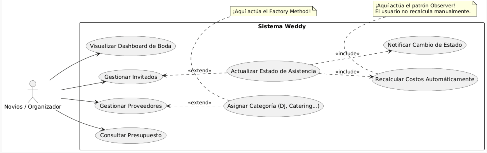

# Proyecto de Diseño de Software – Corte Uno

## Presentación del Problema
La planificación de una boda es un desafío logístico y financiero complejo. Tradicionalmente, las parejas y planificadores utilizan herramientas genéricas como Excel o libretas, lo que genera un "alto acoplamiento manual": si un invitado cambia su estado de asistencia, se debe recalcular manualmente el presupuesto, la asignación de mesas y los servicios contratados. Weddy resuelve este problema centralizando la gestión en una plataforma que automatiza el cálculo de presupuestos y la administración de invitados y proveedores, eliminando el estrés operativo y el margen de error.

## creatividad en la Presentación
Para ilustrar la problemática y como la applicación sulucionaría este problema se realizó un comic que cuanta la historia de una pareja de novios que está organizando su boda, el cual se encuentra incluído en las siguientes diapositivas:.
[Recurso Creativo aquí](https://www.canva.com/design/DAHCFCQ8Uz4/y20kq2oqmsZ60wzm1IkLrg/view)

## Fundamentos de Ingeniería de Software
Nuestro sistema prioriza los siguientes atributos de calidad para asegurar una solución robusta a largo plazo:
* **Mantenibilidad:** Separación estricta entre la interfaz visual (UI) y la lógica de negocio.
* **Escalabilidad:** Capacidad de integrar nuevas funcionalidades (como módulos de auto-asistencia para invitados) o nuevos tipos de proveedores sin fricción.
* **Reusabilidad:** Creación de componentes gráficos genéricos e interfaces de datos completamente abstractas.

## Diseño de Software

**Principios SOLID aplicados:**
* **SRP (Principio de Responsabilidad Única):** Cada clase tiene un único propósito. Por ejemplo, la clase `InvitadoService` maneja exclusivamente la lógica de negocio, mientras que `InvitadoController` solo gestiona el estado hacia la vista.
* **OCP (Principio de Abierto/Cerrado):** Mediante la factoría de proveedores, el sistema está abierto a la extensión (podemos añadir nuevos tipos como "Floristería") pero cerrado a la modificación del código base existente.
* **DIP (Principio de Inversión de Dependencias):** Los servicios de alto nivel dependen de abstracciones (`IInvitadoRepository`) y no de las implementaciones concretas de la base de datos local.

**Patrones de diseño utilizados:**
* **Factory Method (Creacional):** Implementado para la instanciación dinámica de servicios contratados (DJ, Catering, Fotografía). Desacopla al controlador de la construcción concreta de estos objetos complejos.
* **Observer (De Comportamiento):** Implementado para garantizar la reactividad del sistema. Cuando un invitado cambia su estado (ej. de "Pendiente" a "Confirmado"), el módulo financiero (`PresupuestoObserver`) reacciona automáticamente recalculando los costos sin acoplarse directamente a la entidad del invitado.

**UML**:

**Diagrama de casos de uso**

## Implementación

El código fuente sigue una estructura de Arquitectura Limpia, dividiendo las responsabilidades en directorios específicos:
* `/lib/models/`: Contiene las entidades puras del dominio (ej. `boda.dart`, `invitado.dart`).
* `/lib/patterns/`: Aloja la implementación explícita de los patrones.
    * Factory: `proveedor_factory.dart`, `proveedor_dj.dart`, etc.
    * Observer: `invitado_observable.dart`, `presupuesto_observer.dart`.
* `/lib/repositories/`: Define los contratos en `interfaces/` (ej. `i_invitado_repository.dart`) y su persistencia en `impl/`.
* `/lib/services/`: Orquesta la lógica de negocio (ej. `presupuesto_service.dart`).
* `/lib/controllers/`: Intermediarios que conectan los servicios con la interfaz (ej. `invitado_controller.dart`).
* `/lib/ui/`: Pantallas y widgets visuales que consumen exclusivamente a los controladores.

## Análisis Técnico
El diseño del software refleja una **alta cohesión**, ya que cada módulo agrupa funciones estrictamente relacionadas con una sola entidad del dominio. Se logró un **bajo acoplamiento** estableciendo una regla arquitectónica estricta: la capa de presentación (UI) nunca se comunica directamente con los servicios ni los repositorios. Todo flujo de datos pasa obligatoriamente por los controladores, apoyándose en la Inversión de Dependencias, lo que permite que el sistema cumpla con los atributos de mantenibilidad y escalabilidad planteados.

## Créditos y Roles
* **Daniel Riveros** - Diseño UI de la APP.
* **Manuel Castillo** - Arquitectura de la APP.
