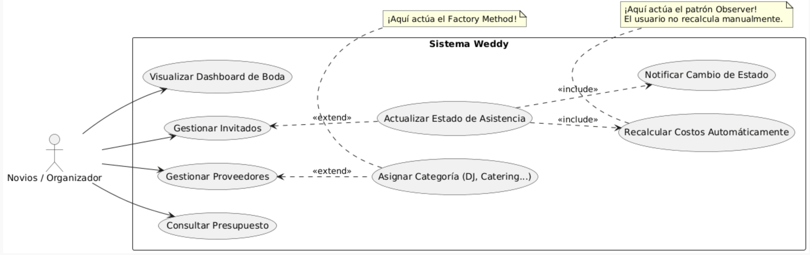
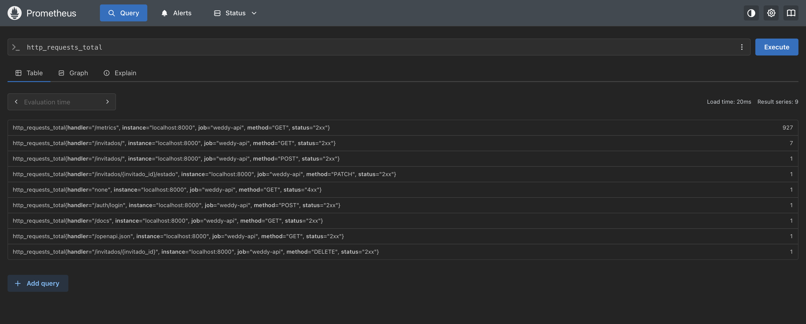
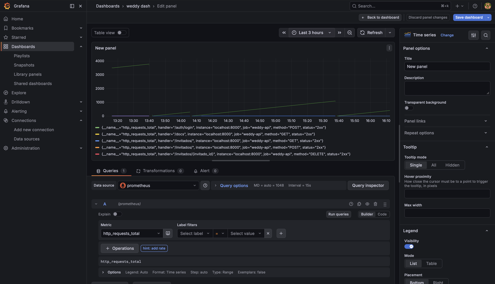
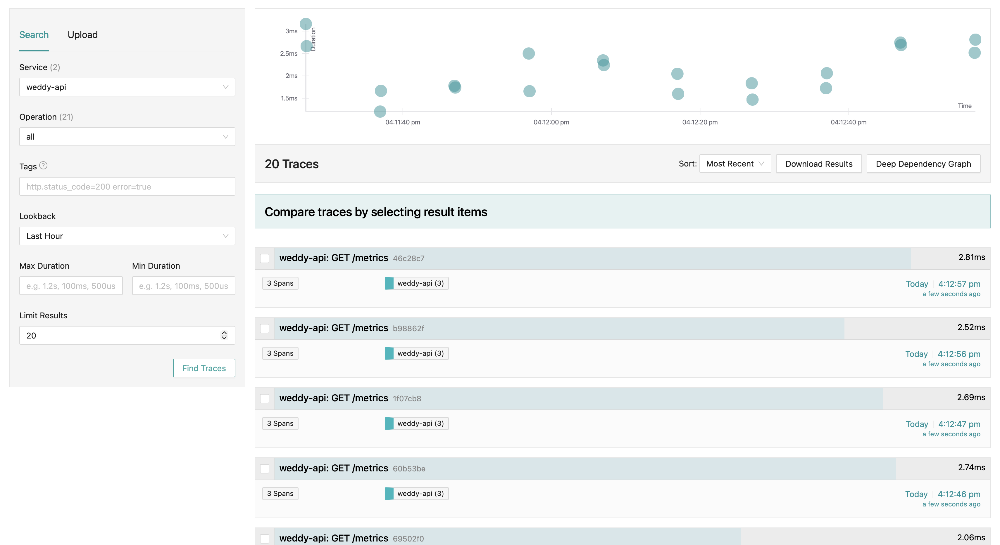

# Weddy — Documentación Arquitectónica

---

## 1. Descripción del sistema

**Weddy** es una plataforma de gestión de bodas que permite a parejas y planificadores centralizar la administración de invitados, presupuesto y proveedores en un solo lugar.

### Problema que resuelve
La planificación de una boda involucra múltiples variables interdependientes. Cuando un invitado cambia su estado de asistencia, el presupuesto debe recalcularse, las mesas deben reorganizarse y los proveedores pueden verse afectados. Gestionar esto manualmente con Excel o libretas genera errores costosos y estrés operativo.

Weddy automatiza estas dependencias: al confirmar un invitado, el sistema recalcula el presupuesto en tiempo real sin intervención manual.

### Atributos de calidad priorizados
- **Mantenibilidad:** separación estricta entre UI, lógica de negocio y datos
- **Resiliencia:** el sistema sigue funcionando aunque el backend falle
- **Observabilidad:** monitoreo en tiempo real del comportamiento del sistema
- **Seguridad:** acceso controlado mediante autenticación JWT

### Recursos creativos
[Comic explicativo del problema](https://www.canva.com/design/DAHCFCQ8Uz4/y20kq2oqmsZ60wzm1IkLrg/view)

---

## 2. Arquitectura inicial

### Descripción
El sistema original era una aplicación Flutter monolítica con toda la lógica y datos en memoria local. No había comunicación con servicios externos ni mecanismos de resiliencia u observabilidad.

### Características
- **Tipo:** aplicación móvil monolítica
- **Datos:** almacenamiento en memoria RAM (sin persistencia)
- **Comunicación:** ninguna — todo ocurría dentro del mismo proceso
- **Seguridad:** ninguna
- **Observabilidad:** ninguna

### Estructura de capas (Clean Architecture)
```
UI (Screens/Widgets)
    ↓
Controllers (InvitadoController, PresupuestoController)
    ↓
Services (InvitadoService, PresupuestoService)
    ↓
Repositories (IInvitadoRepository → InvitadoRepositoryImpl)
    ↓
Data local (in-memory: listas y mapas en Dart)
```

### Patrones implementados en C1
- **Factory Method:** instanciación dinámica de proveedores (DJ, Catering, Fotografía)
- **Observer:** cuando un invitado cambia estado, `PresupuestoObserver` recalcula costos automáticamente
- **Repository:** abstracción de la fuente de datos mediante `IInvitadoRepository`

### Principios SOLID aplicados
- **SRP:** cada clase tiene una única responsabilidad
- **OCP:** nuevos tipos de proveedor se agregan sin modificar código existente
- **DIP:** los servicios dependen de interfaces, no de implementaciones concretas

### Diagrama de clases original


### Diagrama de casos de uso


---

## 3. Arquitectura evolucionada

### Descripción
En el segundo corte, el sistema evolucionó hacia una **arquitectura orientada a servicios**. Se separó la lógica de negocio en un backend independiente (FastAPI) y se convirtió la app Flutter en un cliente que consume ese servicio mediante REST. Se añadieron mecanismos de resiliencia, seguridad y observabilidad.

### Estructura del repositorio
```
/
├── client/        # App Flutter — Servicio Consumidor
├── services/      # Backend FastAPI — Servicio Proveedor
├── monitoring/    # Configuración de observabilidad (Prometheus, Grafana, Jaeger)
├── docs/          # Documentación arquitectónica
├── src/           # Reservado por la rúbrica
└── README.md
```

### Componentes del sistema

| Componente | Tecnología | Rol | Puerto |
|---|---|---|---|
| Weddy API | FastAPI + Python 3.11 | Servicio Proveedor | 8000 |
| App Weddy | Flutter | Servicio Consumidor | — |
| Prometheus | Homebrew / Docker | Recolección de métricas | 9090 |
| Grafana | Homebrew / Docker | Visualización de métricas | 3000 |
| Jaeger | Docker | Trazabilidad distribuida | 16686 |

### Capas del sistema evolucionado
```
[App Flutter — Servicio Consumidor]
    UI (Screens/Widgets)
        ↓
    Controllers
        ↓
    Services (lógica local)          Remote Datasources
        ↓                                   ↓
    Repositories (local cache)       Circuit Breaker
                                            ↓
                                     ApiClient (HTTP)
                                            ↓
                              ══════════════════════════
                              [Weddy API — Servicio Proveedor]
                                     FastAPI Routers
                                            ↓
                                     Auth (JWT)
                                            ↓
                                     Data Store (in-memory)
```

### Comunicación entre servicios
- **Protocolo:** REST sobre HTTP
- **Formato:** JSON
- **Autenticación:** Bearer Token (JWT)
- **Endpoints expuestos:** `/invitados/`, `/presupuesto/`, `/auth/login`, `/metrics`, `/health`

---

## 4. Investigación sobre resiliencia

### ¿Qué es la resiliencia en software?
La resiliencia es la capacidad de un sistema de mantener su funcionamiento ante fallos parciales. En arquitecturas orientadas a servicios, la comunicación entre componentes puede fallar por razones de red, sobrecarga o caídas del servidor. Sin mecanismos de resiliencia, un fallo en el backend puede dejar la app completamente inutilizable.

### Patrones de resiliencia investigados

#### Circuit Breaker (Interruptor de Circuito) — **implementado**
Funciona como un interruptor eléctrico: cuando detecta fallos repetidos, "abre el circuito" y deja de intentar operaciones que probablemente fallarán, protegiendo al sistema y al usuario.

**Estados:**
- **CLOSED (normal):** las peticiones pasan normalmente al backend
- **OPEN (fallo):** el circuito está abierto, las peticiones no se envían, se usa caché
- **HALF-OPEN (recuperación):** después del timeout, se intenta una petición de prueba

#### Retry (Reintentos)
Reintenta automáticamente una operación fallida un número determinado de veces antes de declarar fallo. Útil para fallos transitorios de red.

#### Timeout
Establece un tiempo máximo de espera para una respuesta. Si el servicio no responde en ese tiempo, la operación falla rápidamente en lugar de bloquear indefinidamente.

#### Fallback (Plan B)
Define una respuesta alternativa cuando la operación principal falla. Puede ser un valor por defecto, datos cacheados o una respuesta simplificada.

### Patrón implementado: Circuit Breaker + Fallback

Se implementó Circuit Breaker con Fallback (caché) en la capa de datasources remotos del cliente Flutter.

**Configuración:**
```dart
CircuitBreaker(
  name: 'invitados',
  failureThreshold: 3,      // abre tras 3 fallos consecutivos
  resetTimeout: Duration(seconds: 30),  // intenta reconectar a los 30s
)
```

**Comportamiento:**
1. La app intenta conectar al backend normalmente
2. Si falla 3 veces seguidas → circuito se **abre**
3. Mientras está abierto → app muestra datos cacheados + banner de aviso
4. Tras 30 segundos → circuito pasa a **HALF-OPEN**
5. Se intenta una petición de prueba → si funciona, vuelve a **CLOSED**

**Archivos clave:**
- `client/lib/patterns/circuit_breaker/circuit_breaker.dart` — lógica del patrón
- `client/lib/data/remote/invitado_remote_datasource.dart` — aplicación en invitados
- `client/lib/data/remote/presupuesto_remote_datasource.dart` — aplicación en presupuesto

---

## 5. Observabilidad implementada

### ¿Qué es la observabilidad?
La observabilidad es la capacidad de entender el estado interno de un sistema a partir de sus salidas externas. Un sistema observable permite detectar problemas antes de que el usuario los reporte y entender el comportamiento en producción.

### Herramientas implementadas

#### Prometheus — Recolección de métricas
Prometheus scrapea automáticamente el endpoint `/metrics` del backend cada 10 segundos y almacena series de tiempo con el comportamiento del sistema.

**Métricas recolectadas:**
- `http_requests_total` — total de requests por endpoint, método y código de respuesta
- `http_request_duration_seconds` — latencia de cada endpoint
- `http_request_size_bytes` — tamaño de los requests entrantes
- `http_response_size_bytes` — tamaño de las respuestas enviadas

**Ejemplo de consulta:**
```
http_requests_total{job="weddy-api"}
```

#### Grafana — Visualización
Grafana se conecta a Prometheus como datasource y permite crear dashboards visuales con las métricas en tiempo real. Cada request desde la app Flutter genera un punto en las gráficas.

#### Jaeger — Trazabilidad distribuida
Jaeger recibe trazas de OpenTelemetry desde el backend. Cada request HTTP genera un "span" que registra el tiempo de procesamiento, el endpoint llamado y el resultado. Esto permite identificar cuellos de botella y rastrear el flujo completo de una petición.

**Configuración:** el backend envía trazas via OTLP HTTP al puerto 4318 de Jaeger. Se activa con la variable de entorno `JAEGER_ENABLED=true`.

### Evidencia de observabilidad

#### Prometheus UI — Métricas en tabla

> Captura de pantalla de http://localhost:9090 mostrando `http_requests_total{job="weddy-api"}` con contadores de /invitados/ y /auth/login

#### Grafana — Dashboard con gráfica en tiempo real

> Captura de pantalla de http://localhost:3000 mostrando la gráfica de requests al backend durante la sesión de pruebas

#### Jaeger — Trazas distribuidas

> Captura de pantalla de http://localhost:16686 mostrando las trazas del servicio weddy-api con el detalle de cada span

---

## 6. Evidencia de funcionalidades cubiertas

### Comunicación entre servicios (REST)

| Funcionalidad | Endpoint | Método | Servicio Proveedor | Servicio Consumidor |
|---|---|---|---|---|
| Listar invitados | `/invitados/` | GET | FastAPI devuelve JSON | Flutter renderiza lista |
| Crear invitado | `/invitados/` | POST | FastAPI persiste y retorna | Flutter envía formulario |
| Cambiar estado | `/invitados/{id}/estado` | PATCH | FastAPI actualiza | Flutter actualiza UI |
| Eliminar invitado | `/invitados/{id}` | DELETE | FastAPI elimina | Flutter remueve de lista |
| Ver presupuesto | `/presupuesto/` | GET | FastAPI calcula y retorna | Flutter muestra resumen |
| Configurar presupuesto | `/presupuesto/configurar` | POST | FastAPI actualiza config | Flutter envía valores |

### Resiliencia (Circuit Breaker)

| Escenario | Comportamiento esperado | Resultado |
|---|---|---|
| Backend activo | Requests fluyen normalmente | ✅ Lista y presupuesto cargan |
| 1-2 fallos | Circuito sigue CLOSED | ✅ Muestra error puntual |
| 3 fallos consecutivos | Circuito se ABRE | ✅ Banner naranja + datos en caché |
| Circuito abierto | No envía más requests | ✅ App sigue usable con datos cacheados |
| Tras 30 segundos | Pasa a HALF-OPEN | ✅ Intenta reconectar |
| Backend vuelve | Circuito se CIERRA | ✅ Datos frescos del backend |

### Seguridad (JWT)

| Endpoint | Sin token | Con token válido | Con token vencido |
|---|---|---|---|
| `GET /invitados/` | ✅ 200 OK | ✅ 200 OK | ✅ 200 OK |
| `POST /invitados/` | ❌ 403 Forbidden | ✅ 201 Created | ❌ 401 Unauthorized |
| `PATCH /invitados/{id}/estado` | ❌ 403 Forbidden | ✅ 200 OK | ❌ 401 Unauthorized |
| `POST /presupuesto/configurar` | ❌ 403 Forbidden | ✅ 200 OK | ❌ 401 Unauthorized |

### Observabilidad

| Herramienta | Qué monitorea | Evidencia |
|---|---|---|
| Prometheus | Contadores y latencia de todos los endpoints | Ver captura en sección 5 |
| Grafana | Gráfica temporal de requests en tiempo real | Ver captura en sección 5 |
| Jaeger | Trazas distribuidas de cada request | Ver captura en sección 5 |

---

## 7. Diagramas arquitectónicos

### 7.1 Arquitectura general del sistema


> **Descripción:** diagrama que muestra los tres componentes principales del sistema (App Flutter, Weddy API, Stack de Observabilidad) y cómo se relacionan entre sí. La app consume el backend via REST, el backend expone métricas a Prometheus, Prometheus alimenta Grafana, y el backend envía trazas a Jaeger.

---

### 7.2 Diagrama de interacción entre servicios


> **Descripción:** diagrama de secuencia que muestra el flujo completo de una operación:
>
> **Flujo normal (circuito CLOSED):**
> ```
> Usuario → App Flutter → Circuit Breaker → ApiClient → POST /invitados/ → FastAPI
>                                                                               ↓
>                                                                        Valida JWT
>                                                                               ↓
>                                                                        Guarda datos
>                                                                               ↓
> Usuario ← App Flutter ← Circuit Breaker ← ApiClient ← 201 Created ← FastAPI
> ```
>
> **Flujo con fallo (circuito OPEN):**
> ```
> Usuario → App Flutter → Circuit Breaker → [BLOQUEADO — circuito abierto]
>                                                    ↓
>                                             Devuelve caché
>                                                    ↓
> Usuario ← App Flutter ← Banner naranja + datos cacheados
> ```

---

## 8. Instrucciones de ejecución

Ver guía completa en [docs/guia-ejecucion.md](docs/guia-ejecucion.md)

### Resumen rápido

**Terminal 1 — Backend:**
```bash
cd services
source .venv/bin/activate
JAEGER_ENABLED=true uvicorn main:app --host 0.0.0.0
```

**Terminal 2 — Token JWT:**
```bash
curl -X POST http://localhost:8000/auth/login \
  -H "Content-Type: application/json" \
  -d '{"username":"admin","password":"weddy2024"}'
```
Pega el token en `client/lib/data/remote/api_client.dart` línea 27.

**Terminal 3 — Observabilidad:**
```bash
brew services restart prometheus
brew services restart grafana
cd monitoring && docker compose up -d
```

**Terminal 4 — App:**
```bash
cd client && flutter run
```

| Herramienta | URL |
|---|---|
| API docs | http://localhost:8000/docs |
| Prometheus | http://localhost:9090 |
| Grafana | http://localhost:3000 (admin / weddy2024) |
| Jaeger | http://localhost:16686 |

---

## 9. Créditos

- **Daniel Riveros** — Diseño de Experiencia de Usuario (UI/UX), Integración Frontend y Dirección Creativa
- **Manuel Castillo** — Arquitectura de Software e Implementación de Patrones
