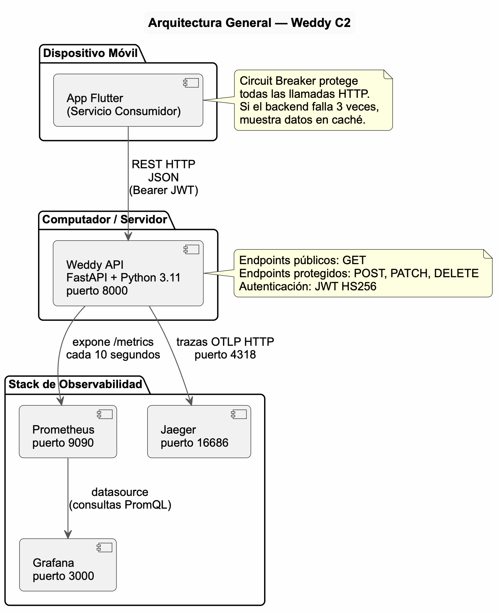
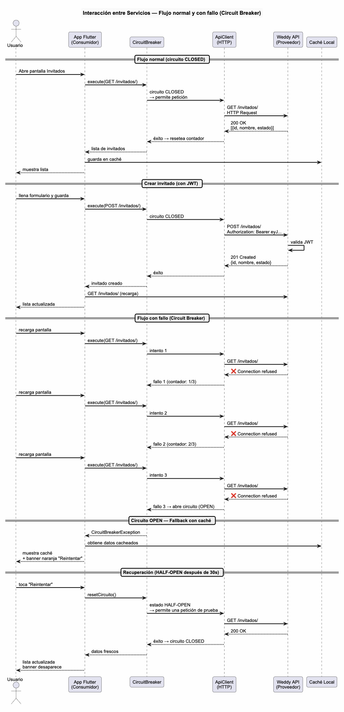

# Arquitectura del Sistema — Weddy

## 1. Descripción del sistema

**Weddy** es una plataforma de gestión de bodas que centraliza la administración de invitados, presupuesto y proveedores. El sistema permite registrar invitados, actualizar su estado de asistencia y calcular automáticamente el presupuesto en función de los confirmados.

### Problema que resuelve
Cuando un invitado confirma asistencia, el presupuesto debe recalcularse, las mesas deben ajustarse y los proveedores pueden verse afectados. Gestionar esto manualmente genera errores y estrés operativo. Weddy automatiza estas dependencias.

---

## 2. Arquitectura inicial (Corte 1)

### Descripción general
El sistema original era una aplicación Flutter monolítica. Toda la lógica —modelos, repositorios, servicios y UI— convivía en un solo proceso sin comunicación externa. Los datos vivían en memoria RAM y se perdían al cerrar la app.

### Características
- **Tipo:** aplicación móvil local (sin backend)
- **Datos:** listas y mapas en memoria Dart (sin persistencia)
- **Comunicación externa:** ninguna
- **Seguridad:** ninguna
- **Observabilidad:** ninguna

### Estructura de capas
```
UI  →  Controllers  →  Services  →  Repositories  →  Datos en memoria
```

Cada capa solo se comunicaba con la inmediatamente inferior, siguiendo Clean Architecture.

### Patrones de diseño implementados
- **Factory Method:** instanciación dinámica de proveedores (DJ, Catering, Fotografía) sin acoplar el controlador a clases concretas
- **Observer:** `PresupuestoObserver` y `NotificacionObserver` reaccionan automáticamente cuando un invitado cambia de estado
- **Repository:** `IInvitadoRepository` define el contrato de acceso a datos; `InvitadoRepositoryImpl` lo implementa con listas en memoria

### Limitaciones identificadas
- Imposible compartir datos entre dispositivos
- Sin capacidad de monitoreo ni auditoría
- Sin control de acceso
- Toda la lógica de negocio expuesta en el cliente

---

## 3. Arquitectura evolucionada (Corte 2)

### Descripción general
El sistema evolucionó hacia una **arquitectura orientada a servicios**. La lógica de negocio se extrajo a un backend independiente (FastAPI), y la app Flutter pasó a ser un cliente que consume ese backend mediante peticiones HTTP REST. Se incorporaron mecanismos de resiliencia, seguridad y observabilidad.

### Diagrama de arquitectura general



### Estructura del repositorio
```
/
├── client/      → App Flutter (Servicio Consumidor)
├── services/    → Backend FastAPI (Servicio Proveedor)
├── monitoring/  → Configuración de Prometheus, Grafana y Jaeger
├── docs/        → Documentación arquitectónica
└── src/         → Reservado por la rúbrica
```

### Componentes del sistema

| Componente | Tecnología | Rol | Puerto |
|---|---|---|---|
| Weddy API | FastAPI + Python 3.11 | Servicio Proveedor | 8000 |
| App Weddy | Flutter (Dart) | Servicio Consumidor | — |
| Prometheus | Homebrew / Docker | Recolección de métricas | 9090 |
| Grafana | Homebrew / Docker | Visualización de métricas | 3000 |
| Jaeger | Docker | Trazabilidad distribuida | 16686 |

### Servicio Proveedor — Weddy API (FastAPI)
El backend expone una API REST que:
- Gestiona invitados y presupuesto con lógica de negocio centralizada
- Protege endpoints de escritura mediante JWT
- Expone métricas en `/metrics` para Prometheus
- Envía trazas a Jaeger mediante OpenTelemetry

**Endpoints disponibles:**

| Endpoint | Método | Acceso | Descripción |
|---|---|---|---|
| `/auth/login` | POST | Público | Genera token JWT |
| `/invitados/` | GET | Público | Lista todos los invitados |
| `/invitados/` | POST | Protegido | Crea un nuevo invitado |
| `/invitados/{id}/estado` | PATCH | Protegido | Cambia el estado de asistencia |
| `/invitados/{id}` | DELETE | Protegido | Elimina un invitado |
| `/presupuesto/` | GET | Público | Obtiene el resumen de presupuesto |
| `/presupuesto/configurar` | POST | Protegido | Actualiza la configuración |
| `/metrics` | GET | Público | Métricas para Prometheus |
| `/health` | GET | Público | Estado del servicio |

### Servicio Consumidor — App Flutter
La app Flutter consume el backend mediante:
- `ApiClient` — cliente HTTP centralizado con manejo de headers y autenticación
- `InvitadoRemoteDatasource` — datasource remoto con Circuit Breaker y caché local
- `PresupuestoRemoteDatasource` — datasource remoto con Circuit Breaker y caché local

La app mantiene compatibilidad con la arquitectura del Corte 1: `BodaController` sigue funcionando con datos locales, mientras que `InvitadoController` sincroniza los datos del backend hacia la capa local mediante `InvitadoService.sincronizar()`.

### Intercambio de información
La comunicación entre los dos servicios ocurre así:

```
App Flutter                          Weddy API
    |                                    |
    |  GET /invitados/                   |
    | ---------------------------------> |
    |                                    |  Lee datos en memoria
    |  200 OK + JSON [{id, nombre, ...}] |
    | <--------------------------------- |
    |                                    |
    |  POST /invitados/ + Bearer token   |
    | ---------------------------------> |
    |                                    |  Valida JWT → Guarda dato
    |  201 Created + JSON {id, nombre}   |
    | <--------------------------------- |
```

### Diagrama de interacción entre servicios



### Mejoras respecto al Corte 1

| Aspecto | Corte 1 | Corte 2 |
|---|---|---|
| Datos | Solo en memoria del cliente | En backend centralizado |
| Comunicación | Ninguna | REST + JSON |
| Resiliencia | Ninguna | Circuit Breaker + caché |
| Seguridad | Ninguna | JWT (HS256) |
| Observabilidad | Ninguna | Prometheus + Grafana + Jaeger |
| Escalabilidad | No escalable | Backend independiente, escalable por separado |

---

## 4. Justificación de decisiones técnicas

- **FastAPI sobre otras opciones:** rendimiento alto, documentación automática (`/docs`), tipado nativo con Pydantic, ideal para APIs REST académicas y productivas
- **Flutter como consumidor:** mantiene toda la funcionalidad del Corte 1, se añade la capa remota sin romper la arquitectura existente
- **Datos en memoria:** suficiente para demostrar la arquitectura orientada a servicios sin añadir complejidad de bases de datos; en producción se reemplazaría por PostgreSQL o similar
- **JWT HS256:** estándar de la industria para autenticación stateless, simple de implementar y verificar

---

## 5. Conclusión

La evolución de Weddy demuestra cómo una aplicación monolítica puede transformarse en una arquitectura orientada a servicios manteniendo la funcionalidad existente. El sistema resultante tiene roles claramente diferenciados (proveedor y consumidor), comunicación estandarizada (REST + JSON), mecanismos de resiliencia ante fallos y capacidad de monitoreo en tiempo real.
